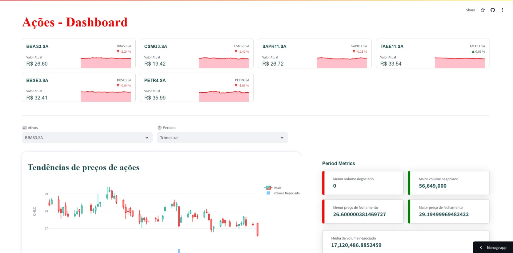

<h1 align="center">Webapp para Análise de Ações</h1>

  <a href="#-tecnologias">Tecnologias</a>&nbsp;&nbsp;&nbsp;|&nbsp;&nbsp;&nbsp;
  <a href="#-projeto">Projeto</a>&nbsp;&nbsp;&nbsp;|&nbsp;&nbsp;&nbsp;
  <a href="#memo-licença">Licença</a>

  

    Projeto de estudo sobre a ferramenta Streamlit e personalização da mesma utilizando CSS.

A inspiração para construção desse projeto veio do canal do Fanilo Andrianasolo : <a href="https://www.youtube.com/@andfanilo">@andfanilo/</a> 

## 🚀 Tecnologias

Esse projeto foi desenvolvido com as seguintes tecnologias:

- Python
- Streamlit
- Plotly
- CSS
- YFinance

## 💻 Projeto

### Abaixo segue a definição para cada uma das 17 variáveis:
- open - Preço de abertura da ação no início do período de negociação (por exemplo, início do dia).
- oigh - O preço mais alto atingido pela ação durante o período de negociação.
- low - O preço mais baixo atingido pela ação durante o período de negociação.
- close - Preço de fechamento da ação no final do período de negociação.
- ticker - Símbolo da ação que identifica a empresa no mercado de ações.
- last_trade_time - O horário da última transação realizada com a ação.
- last_price - O preço da última transação realizada com a ação.
- previous_day_price - O preço de fechamento da ação no dia anterior.
- change - A diferença entre o preço de fechamento atual e o preço de fechamento do dia anterior (close - previous_day_price).
- change_pct - A variação percentual no preço da ação em relação ao preço de fechamento do dia anterior.
- marketcap - Valor de mercado da empresa, calculado multiplicando o número total de ações em circulação pelo preço atual da ação. Indica o valor total de mercado de uma empresa.

## :memo: Licença

Esse projeto está sob a licença GNU AFFERO GENERAL PUBLIC LICENSE.

---

Feito com ♥ by Robson :wave: [Contato](https://www.linkedin.com/in/robsonlopesjr/)